## Proyecto final Programacion WEB

### Capturas correspondientes a las vistas de la aplicacion

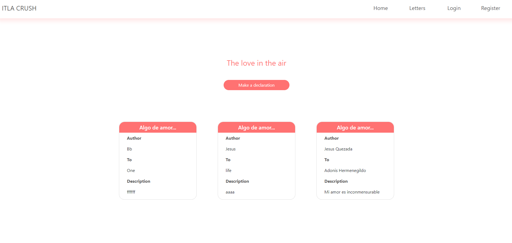
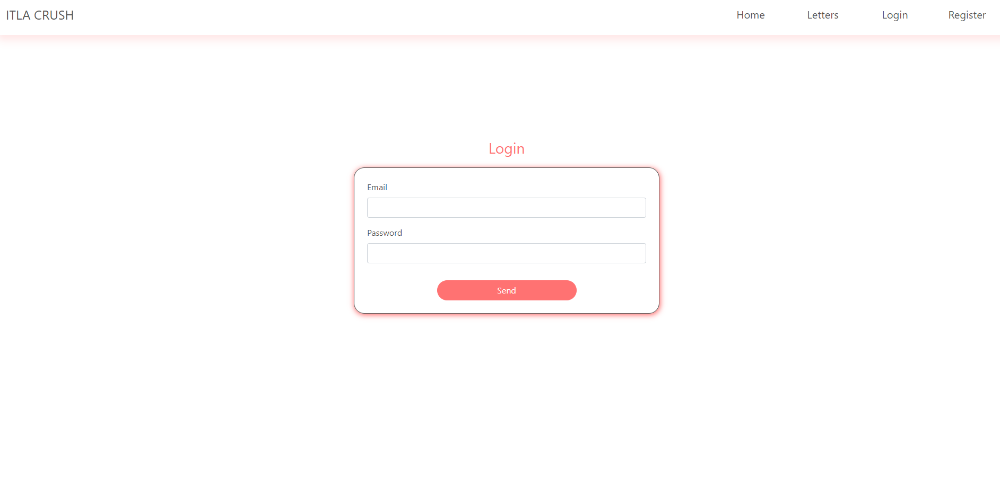

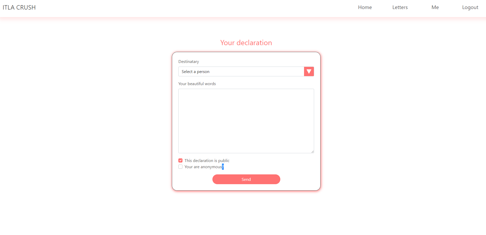

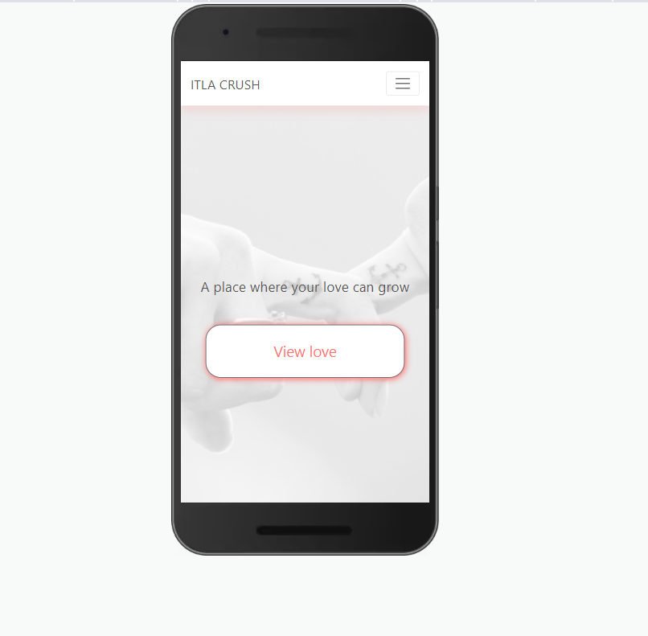
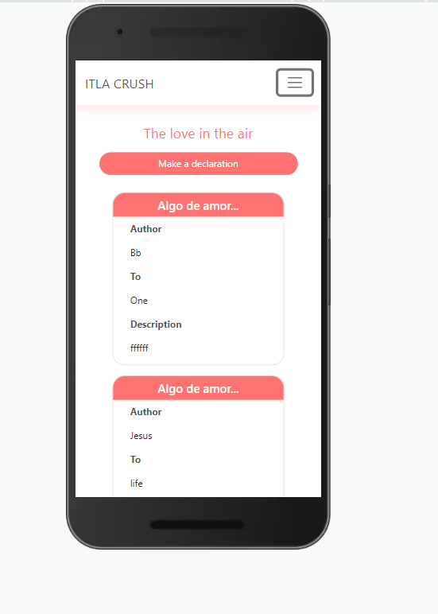
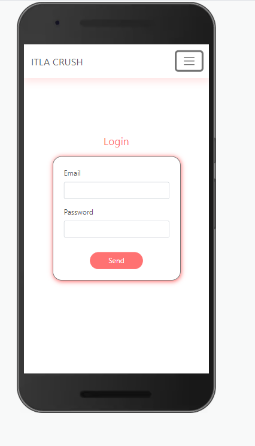

### Esquema WIREFRAME
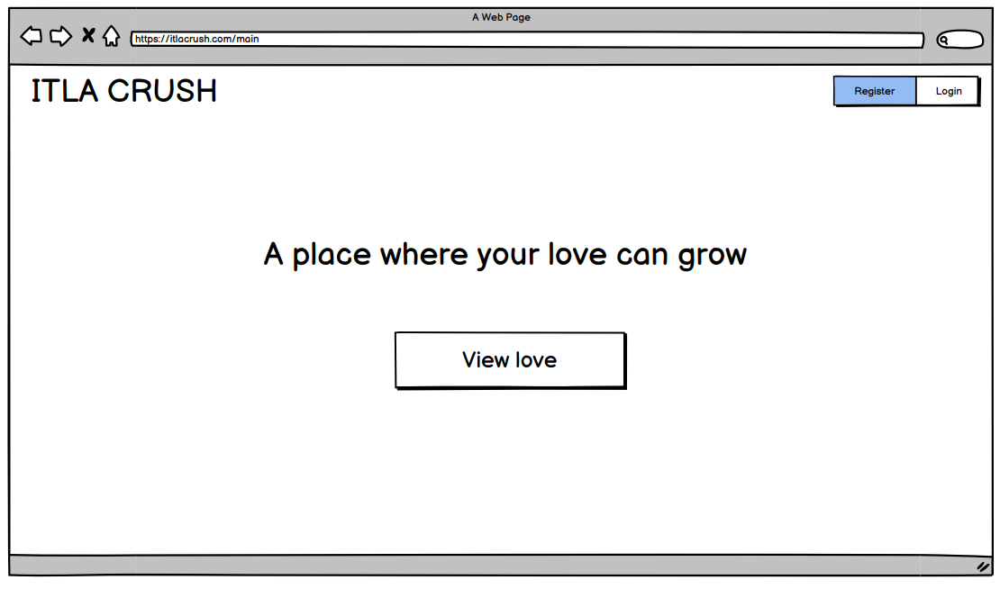
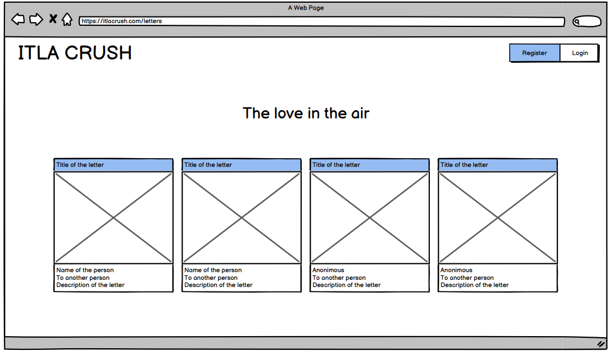
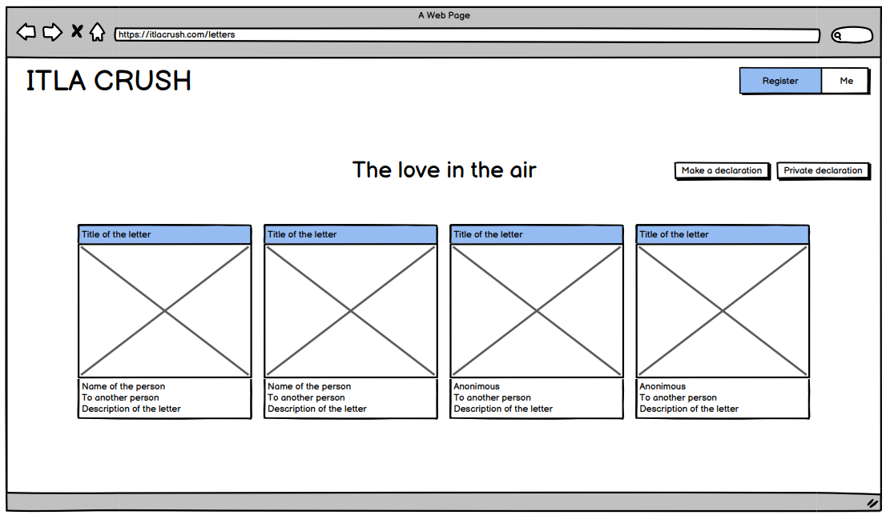
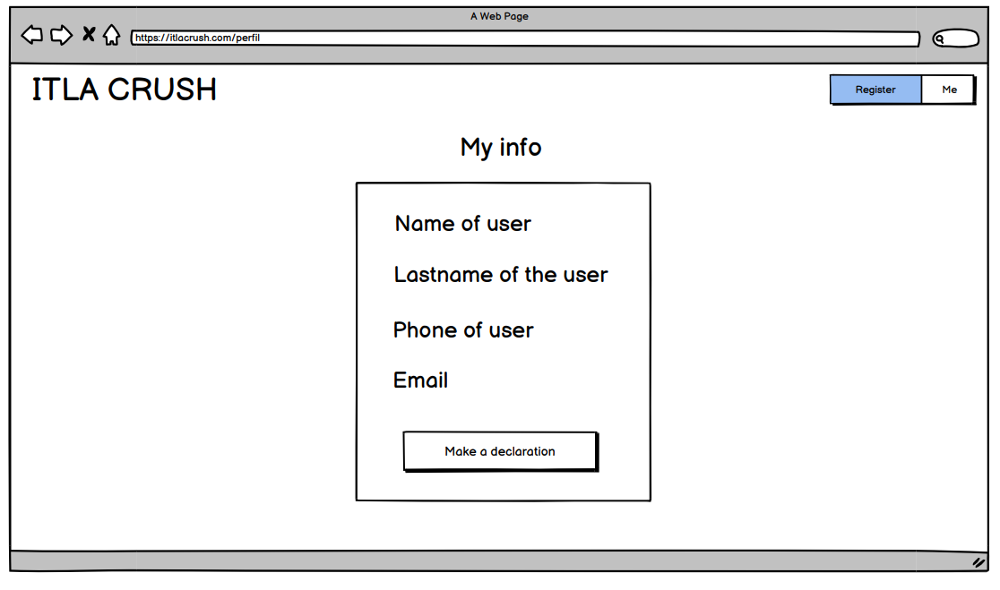
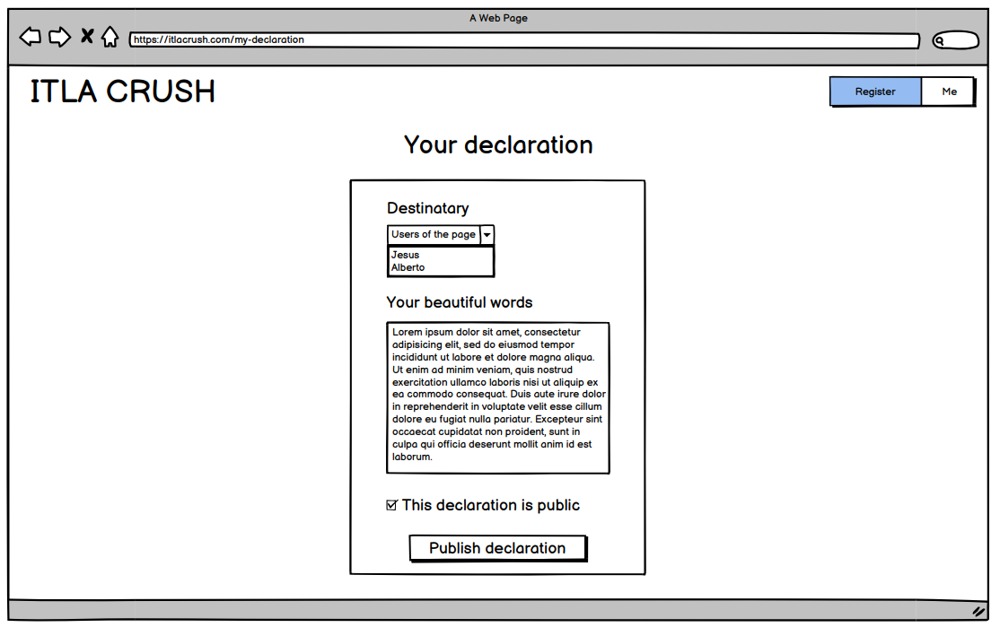
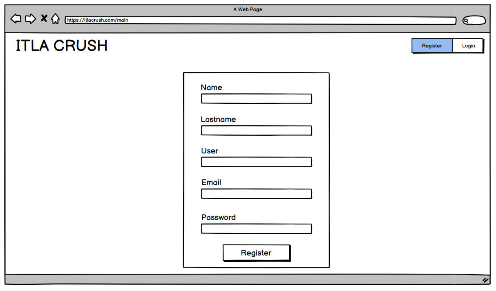

### Links asociados

#### Pagina publicada: itla-crush-2022.netlify.app